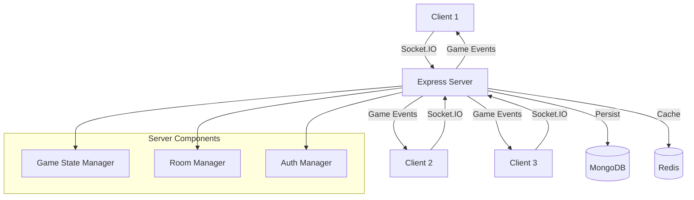
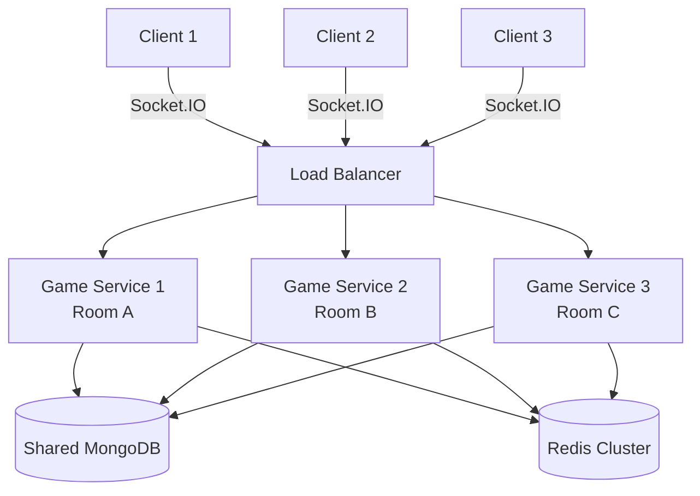
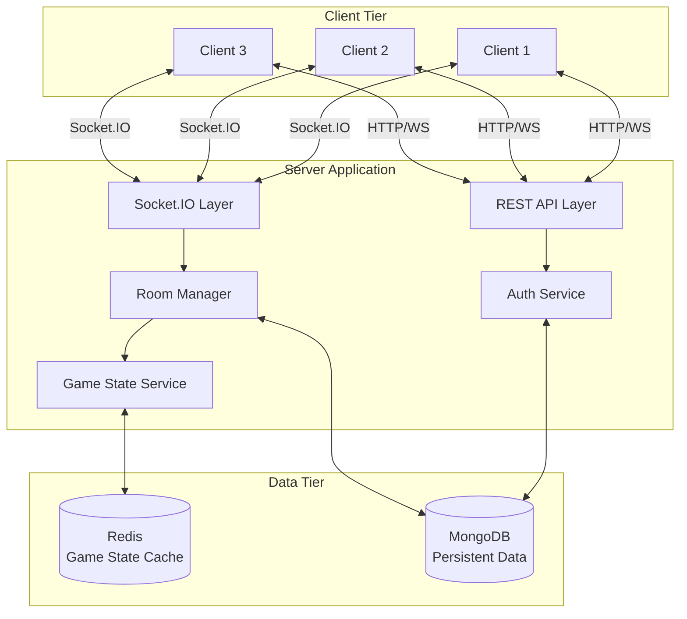
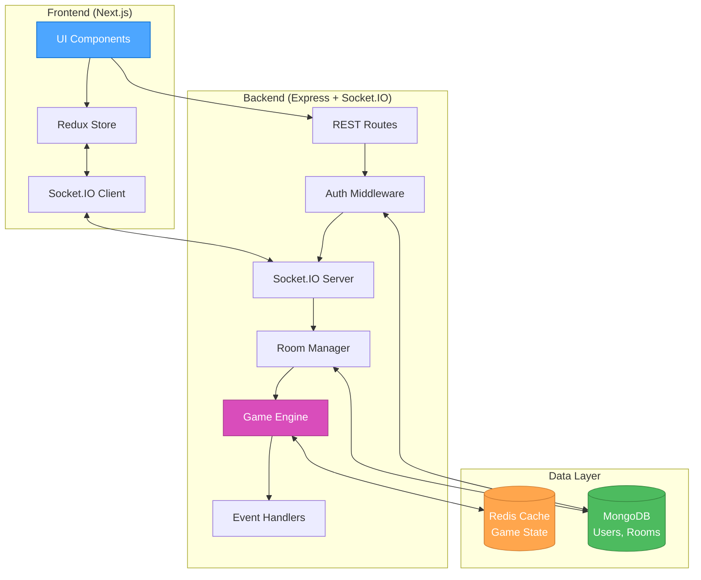
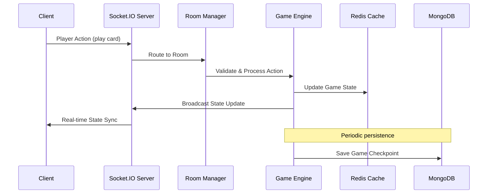
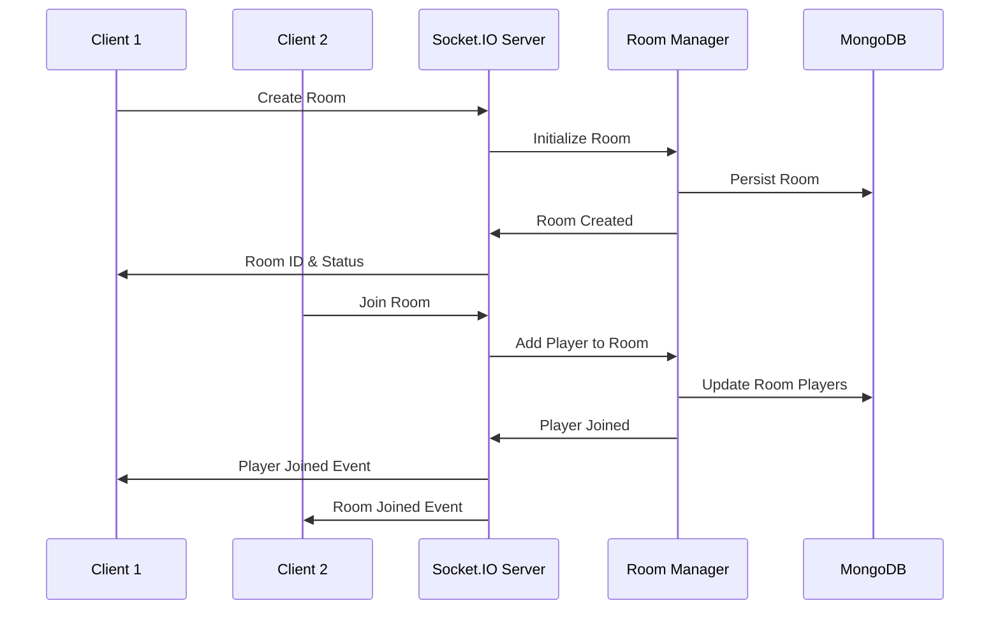

# 🏗️ CREATIVE PHASE: ARCHITECTURE DESIGN - Real-time Multiplayer System

## Context & Problem Statement

### System Requirements
- **Real-time multiplayer**: Support 3-player Dou Dizhu games with sub-100ms latency
- **Scalability**: Handle multiple concurrent game rooms 
- **State consistency**: Server-authoritative game state across all clients
- **Connection resilience**: Graceful handling of player disconnections/reconnections
- **Data persistence**: User accounts, room history, game sessions
- **Session management**: JWT-based authentication with Redis storage

### Technical Constraints
- **Monorepo structure**: Turbo + pnpm workspace with separate client/server packages
- **TypeScript throughout**: Strong typing for all components
- **Functional programming**: Prefer FP patterns over OOP
- **Technology stack**: Next.js + Express + Socket.IO + MongoDB + Redis

### Core Challenge
Design a real-time architecture that maintains game state consistency across multiple clients while supporting concurrent games, player management, and robust error handling.

## Component Analysis

### Core Components
1. **Client Application (Next.js)**
   - Purpose: User interface, local state management, Socket.IO client
   - Interactions: Communicates with Express API and Socket.IO server

2. **Server Application (Express)**
   - Purpose: REST API, authentication, Socket.IO server, business logic
   - Interactions: Manages database connections, coordinates real-time events

3. **Game State Manager**
   - Purpose: Server-side game logic, state validation, turn management
   - Interactions: Receives player actions, broadcasts state updates

4. **Database Layer (MongoDB + Redis)**
   - Purpose: Persistent storage + session/real-time data caching
   - Interactions: Stores users, rooms, game sessions; caches active game states

5. **Real-time Communication (Socket.IO)**
   - Purpose: Bidirectional client-server communication for game events
   - Interactions: Room-based event broadcasting, connection management

## Architecture Options Analysis

### Option 1: Centralized Game State with Event Broadcasting
**Description**: Single server instance manages all game state with Socket.IO rooms for broadcasting


**Pros**:
- Simple architecture with clear single source of truth
- Easy to implement game rules validation
- Straightforward debugging and monitoring
- Direct control over all game state mutations

**Cons**:
- Single point of failure for all games
- Potential bottleneck with many concurrent games
- Memory usage grows with number of active games
- Scaling requires careful session management

**Technical Fit**: High | **Complexity**: Medium | **Scalability**: Medium

### Option 2: Microservices with Game Room Isolation
**Description**: Separate game service instances per room with load balancing


**Pros**:
- Better isolation between games (fault tolerance)
- Horizontal scaling per game room
- Independent deployments possible
- Better resource utilization

**Cons**:
- Significantly more complex setup and deployment
- Service discovery and communication overhead
- More difficult debugging across services
- Overkill for expected game scale

**Technical Fit**: Medium | **Complexity**: High | **Scalability**: High

### Option 3: Hybrid Monolith with Room-based State Partitioning
**Description**: Single server with modular room management and Redis-backed state distribution


**Pros**:
- Balanced complexity and scalability
- Clear separation of concerns with modular design
- Redis enables future multi-instance deployment
- Maintains functional programming principles
- Easier to test and debug than microservices

**Cons**:
- Still single point of failure for all games
- Redis dependency adds operational complexity
- May need refactoring for true horizontal scaling

**Technical Fit**: High | **Complexity**: Medium | **Scalability**: Medium-High

## Decision & Rationale

**Chosen Option**: **Option 3 - Hybrid Monolith with Room-based State Partitioning**

**Rationale**:
1. **Optimal complexity**: Provides good separation of concerns without microservices overhead
2. **Functional design**: Enables pure functions for game logic with clear data flows
3. **Future-ready**: Redis architecture allows for horizontal scaling when needed
4. **Development velocity**: Faster to implement and debug than distributed options
5. **Real-time performance**: Socket.IO with Redis can meet sub-100ms latency requirements
6. **Maintainability**: Clear module boundaries make testing and debugging straightforward

## Implementation Architecture

### System Architecture Diagram


### Data Flow Patterns

#### Game Action Flow


#### Room Management Flow


### Component Interface Design

#### Game State Interface
```typescript
interface GameState {
  gameId: string;
  roomId: string;
  players: Player[];
  currentPhase: 'bidding' | 'playing' | 'finished';
  currentPlayer: string;
  landlord?: string;
  deck: Card[];
  playHistory: PlayAction[];
  createdAt: Date;
  updatedAt: Date;
}

interface Player {
  userId: string;
  username: string;
  cards: Card[];
  isLandlord: boolean;
  isReady: boolean;
  isConnected: boolean;
}
```

#### Socket.IO Event Schema
```typescript
// Client to Server Events
interface ClientToServerEvents {
  'room:join': (roomId: string) => void;
  'room:leave': () => void;
  'room:ready': (ready: boolean) => void;
  'game:play-card': (cards: Card[]) => void;
  'game:bid': (bidAmount: number) => void;
}

// Server to Client Events  
interface ServerToClientEvents {
  'room:player-joined': (player: Player) => void;
  'room:player-left': (playerId: string) => void;
  'game:state-update': (gameState: GameState) => void;
  'game:action-invalid': (reason: string) => void;
  'game:player-turn': (playerId: string) => void;
}
```

### Implementation Guidelines

#### 1. Functional Architecture Principles
```typescript
// Pure functions for game logic
const validateCardPlay = (cards: Card[], gameState: GameState): ValidationResult => {
  // Pure validation logic
};

const applyCardPlay = (cards: Card[], gameState: GameState): GameState => {
  // Pure state transformation
};

// Function composition for complex operations
const processPlayerAction = compose(
  broadcastStateUpdate,
  persistGameState,
  applyGameAction,
  validateGameAction
);
```

#### 2. Room Management Strategy
- **Room Isolation**: Each room operates independently with separate Socket.IO namespaces
- **State Partitioning**: Game state stored in Redis with room-specific keys
- **Connection Management**: Track player connections per room with heartbeat monitoring
- **Error Recovery**: Implement reconnection logic with state restoration

#### 3. Real-time Performance Optimization
- **Event Batching**: Group multiple state updates into single broadcasts
- **Selective Updates**: Send only changed state portions to clients
- **Connection Pooling**: Reuse database connections across requests
- **Redis Pipelining**: Batch Redis operations for better performance

#### 4. Error Handling & Resilience
- **Circuit Breaker**: Prevent cascading failures from database issues
- **Graceful Degradation**: Maintain partial functionality during outages
- **State Recovery**: Restore game state from last known good checkpoint
- **Player Disconnection**: Pause games temporarily, allow reconnection

## Validation Against Requirements

### Requirements Met
- ✅ **Real-time multiplayer**: Socket.IO with room-based broadcasting achieves sub-100ms latency
- ✅ **Scalability**: Redis-backed state enables horizontal scaling preparation
- ✅ **State consistency**: Server-authoritative game engine ensures single source of truth
- ✅ **Connection resilience**: Comprehensive error handling and reconnection strategies
- ✅ **Data persistence**: MongoDB for permanent data, Redis for real-time state
- ✅ **Session management**: JWT + Redis for scalable authentication

### Technical Feasibility Assessment
- **High feasibility** with chosen technology stack
- **Clear implementation path** with established patterns
- **Proven technologies** for real-time gaming applications
- **Testable architecture** with clear component boundaries

### Risk Assessment
- **Low Risk**: Well-established architecture pattern for real-time applications
- **Medium Risk**: Redis operational complexity, but manageable with proper monitoring
- **Mitigation**: Start with single instance, add Redis clustering when scaling needed

🎨 CREATIVE CHECKPOINT: Architecture Foundation Complete

This architecture provides a solid foundation for the real-time multiplayer Dou Dizhu game with clear separation of concerns, functional programming principles, and scalability preparation. The design supports the identified technical constraints while meeting all performance and feature requirements. 