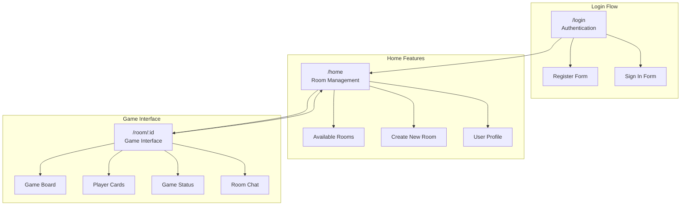
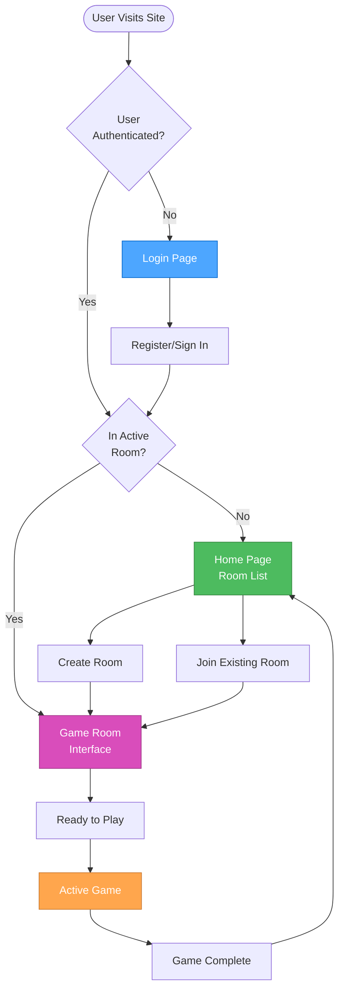
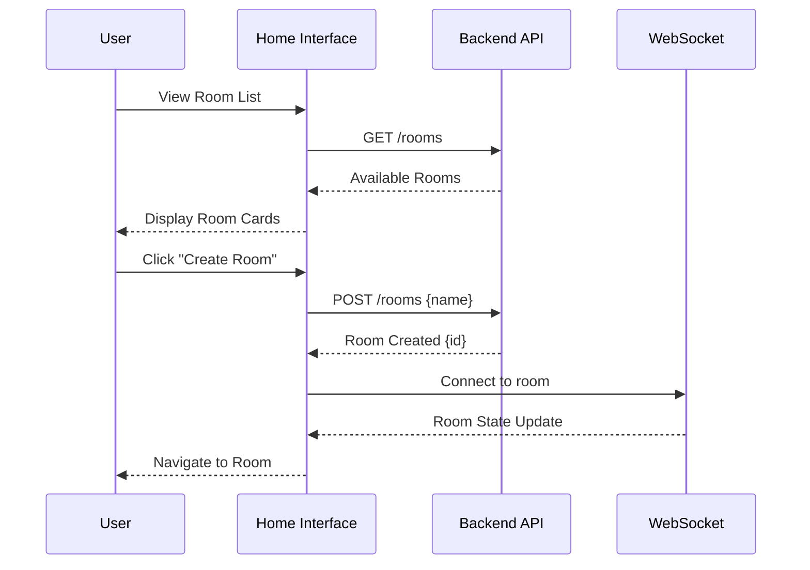
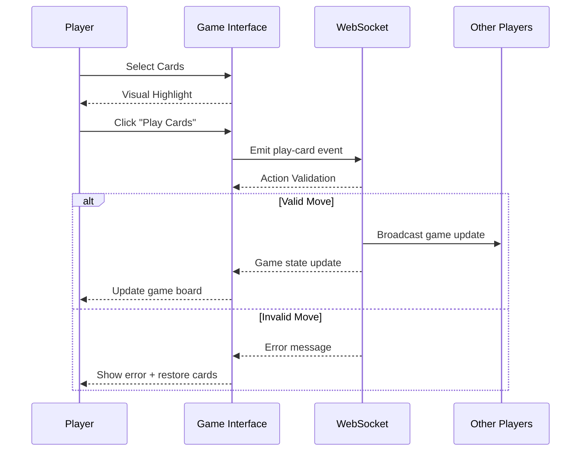
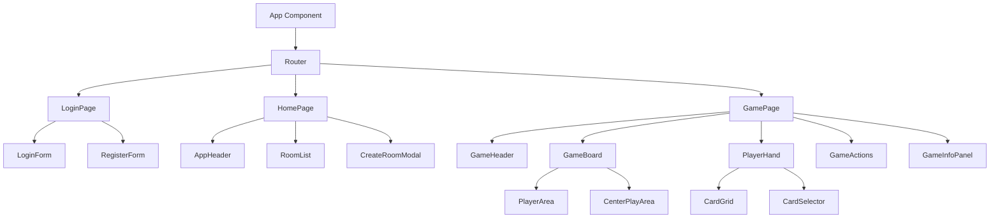

# 🎨 CREATIVE PHASE: UI/UX DESIGN - Dou Dizhu Game Interface

## Context & Problem Statement

### User Needs Analysis
**Primary Users**: Players who want to play Dou Dizhu online with friends
**Core Goals**:
- Quick and intuitive room creation/joining
- Clear game state visibility during real-time play
- Responsive card interaction with minimal latency
- Seamless authentication and room management

**User Personas**:
1. **Casual Player**: Wants simple, quick access to games
2. **Social Player**: Focuses on playing with friends, needs easy room sharing
3. **Experienced Player**: Expects fast gameplay, minimal UI friction

### User Stories & Requirements
1. **As a new user**, I want to register and login easily so I can start playing quickly
2. **As a player**, I want to see available rooms so I can join existing games
3. **As a room creator**, I want to invite friends easily so we can play together
4. **As a game player**, I want clear visual feedback on game state so I understand what's happening
5. **As a card player**, I want intuitive card selection and playing so the interface doesn't slow down gameplay

### Current Challenge
Design an intuitive, responsive game interface that supports real-time multiplayer interactions while maintaining clarity of game state across complex Dou Dizhu rules and 3-player coordination.

## Information Architecture

### Site Structure


### Navigation Patterns
- **Single Page App**: Seamless transitions between login → home → game
- **Auto-routing**: Automatic redirects based on user state and room membership
- **Breadcrumb Context**: Clear indication of current location and available actions

## User Flow Design

### Complete User Journey


### Detailed Interaction Flows

#### Room Management Flow


#### Game Play Flow


## UI/UX Design Options Analysis

### Option 1: Traditional Desktop Card Game Layout
**Description**: Desktop-focused design with fixed layout and detailed information panels
```
┌─────────────────────────────────────────────────────────────┐
│                    Player 2 (Top)                          │
│                   [Card Count: 12]                         │
│                                                             │
│  Player 1     ┌─────────────────────┐        Player 3      │
│  (Left)       │                     │        (Right)       │
│  [Cards: 11]  │    Center Play      │        [Cards: 10]   │
│               │      Area           │                       │
│               └─────────────────────┘                       │
│                                                             │
│              Current Player Hand (Bottom)                   │
│    [Card][Card][Card][Card][Card][Card][Card]              │
│         [Ready] [Pass] [Play Selected]                     │
└─────────────────────────────────────────────────────────────┘
```

**Pros**:
- Clear separation of player areas
- Familiar card game layout
- Detailed information display
- Easy mouse-based card selection

**Cons**:
- Not mobile responsive
- Fixed aspect ratio requirements
- May feel cramped on smaller screens
- Traditional, not modern

**Usability**: High | **Mobile**: Low | **Aesthetics**: Medium | **Complexity**: Low

### Option 2: Mobile-First Responsive Card Interface
**Description**: Responsive design optimized for touch interactions with collapsible panels
```
Mobile Layout:                Desktop Layout:
┌─────────────────┐          ┌─────────────────────────────┐
│   Player 2      │          │ P2    Center Play     P3    │
│   [Cards: 12]   │          │ Left   [Last Play]   Right  │
│                 │          │                             │
│  Center Play    │    →     │        Your Cards           │
│  [Last Cards]   │          │ [C][C][C][C][C][C][C]      │
│                 │          │   [Ready] [Pass] [Play]     │
│   Your Cards    │          └─────────────────────────────┘
│ [C][C][C][C]    │
│  [Actions]      │
└─────────────────┘
```

**Pros**:
- Mobile-optimized touch interface
- Responsive across all screen sizes
- Modern, clean design
- Gesture-based card interactions
- Progressive disclosure of information

**Cons**:
- More complex responsive implementation
- May hide information on small screens
- Requires gesture education for users
- Different experience across devices

**Usability**: High | **Mobile**: High | **Aesthetics**: High | **Complexity**: High

### Option 3: Hybrid Adaptive Interface
**Description**: Adaptive layout that provides optimal experience for both desktop and mobile
```
Tablet/Desktop View:
┌─────────────────────────────────────────────────────────────┐
│  Player 2 (Top) [Cards: 12]    Game Info Panel             │
│                                 Turn: Player 1             │
│                                 Phase: Playing             │
│ P1 [11] ┌─────────────────┐ P3 [10]  Last Play: 3,4,5     │
│         │   Center Play   │                                │
│         │   [3][4][5]     │     Chat                       │
│         └─────────────────┘     Messages...                │
│                                                             │
│         Your Hand (Sortable)                               │
│    [Card][Card][Card][Card][Card][Card]                    │
│         [Ready] [Pass] [Play Selected]                     │
└─────────────────────────────────────────────────────────────┘

Mobile View:
┌─────────────────┐
│ Game Status     │ ← Collapsible
│ Turn: Player 1  │
├─────────────────┤
│   Player 2      │
│   [12 cards]    │
├─────────────────┤
│ Center: [3][4][5]│
├─────────────────┤
│ P1[11]    P3[10]│
├─────────────────┤
│   Your Cards    │
│ [C][C][C][C][C] │
│  [Ready][Play]  │
└─────────────────┘
```

**Pros**:
- Optimized for each device type
- Information density scales appropriately
- Familiar patterns for each platform
- Maintains consistency across experiences
- Accessible on all devices

**Cons**:
- Most complex to implement
- Requires thorough testing across devices
- May have inconsistent feature parity
- Higher maintenance overhead

**Usability**: High | **Mobile**: High | **Aesthetics**: High | **Complexity**: High

## Decision & Rationale

**Chosen Option**: **Option 3 - Hybrid Adaptive Interface**

**Rationale**:
1. **User Base Coverage**: Supports both mobile and desktop players effectively
2. **Real-time Gaming**: Provides optimal experience for fast-paced card interactions
3. **Information Management**: Balances information density with usability
4. **Future-Proof**: Scales well as user base grows across different devices
5. **Accessibility**: Works well for different user capabilities and preferences
6. **Style Guide Alignment**: Supports TailwindCSS responsive design patterns

## Implementation Design Specifications

### Component Hierarchy


### Key Component Designs

#### 1. Login/Authentication Interface
```typescript
interface LoginPageProps {
  onLogin: (credentials: LoginCredentials) => void;
  isLoading: boolean;
  error?: string;
}

// Visual Design:
// - Clean, centered form with game branding
// - Single form that toggles between login/register
// - Clear error messaging
// - Loading states for all actions
```

#### 2. Room Management Interface
```typescript
interface RoomListProps {
  rooms: Room[];
  onJoinRoom: (roomId: string) => void;
  onCreateRoom: (roomName: string) => void;
  currentUser: User;
}

// Visual Design:
// - Card-based room display with player counts
// - Filter/search for active rooms
// - Quick create room with name input
// - Real-time updates for room status
```

#### 3. Game Board Interface
```typescript
interface GameBoardProps {
  gameState: GameState;
  currentPlayer: Player;
  onCardPlay: (cards: Card[]) => void;
  onActionSelect: (action: GameAction) => void;
}

// Visual Design:
// - Central play area with last played cards
// - Player position indicators with card counts
// - Turn indicator and phase status
// - Responsive layout for different screen sizes
```

#### 4. Card Interaction Design
```typescript
interface PlayerHandProps {
  cards: Card[];
  selectedCards: Card[];
  onCardSelect: (card: Card) => void;
  onCardDeselect: (card: Card) => void;
  canPlay: boolean;
}

// Visual Design:
// - Sortable card hand with suit grouping
// - Visual selection states (highlighted borders)
// - Touch-friendly card sizing
// - Drag and drop support for desktop
```

### Responsive Design Breakpoints
```css
/* Mobile First Approach */
.game-container {
  /* Mobile: < 768px */
  @apply flex flex-col space-y-2 p-2;
  
  /* Tablet: 768px - 1024px */
  @screen md {
    @apply grid grid-cols-3 gap-4 p-4;
  }
  
  /* Desktop: > 1024px */
  @screen lg {
    @apply grid-cols-4 gap-6 p-6;
  }
}
```

### Visual Design Principles
Based on the existing style guide's functional programming principles:

#### Color & Visual Hierarchy
- **Primary Actions**: Clear, prominent buttons for game actions
- **Secondary Info**: Subtle backgrounds for status information
- **Error States**: Clear red indicators for invalid actions
- **Success States**: Green confirmations for valid moves
- **Real-time Updates**: Smooth animations for state changes

#### Typography & Information Design
- **Game Status**: Large, clear fonts for critical game information
- **Player Names**: Medium fonts with clear differentiation
- **Card Text**: Readable fonts with good contrast
- **Action Labels**: Concise, action-oriented text

#### Interaction Patterns
- **Card Selection**: Visual feedback with border highlights
- **Drag and Drop**: Desktop support for card playing
- **Touch Gestures**: Mobile-optimized touch targets
- **Loading States**: Clear progress indicators
- **Error Recovery**: Undo/retry patterns for failed actions

### Accessibility Considerations
- **Keyboard Navigation**: Full keyboard support for all actions
- **Screen Reader**: Proper ARIA labels for game state
- **Color Contrast**: WCAG AA compliance for all text
- **Focus Management**: Clear focus indicators and logical tab order
- **Motor Accessibility**: Large touch targets (minimum 44px)

## User Experience Validation

### Usability Testing Scenarios
1. **New User Onboarding**: Register → Create Room → Invite Friends
2. **Quick Game Join**: Login → Browse Rooms → Join Active Game
3. **Complete Game Flow**: Join Room → Ready Up → Play Full Game
4. **Error Recovery**: Handle disconnection → Reconnect → Resume Game
5. **Mobile Experience**: Complete game flow on mobile device

### Success Metrics
- **Task Completion**: >90% success rate for core user flows
- **Time to First Game**: <2 minutes from landing to active game
- **Error Recovery**: <30 seconds to recover from connection issues
- **Mobile Usability**: Equivalent functionality across all devices
- **User Satisfaction**: Clear, intuitive interface with minimal learning curve

### Performance Requirements
- **Responsive Layout**: Smooth resizing across all breakpoints
- **Animation Performance**: 60fps for all transitions and interactions
- **Touch Response**: <100ms response time for touch interactions
- **Real-time Updates**: <200ms latency for game state synchronization

🎨 CREATIVE CHECKPOINT: UI/UX Foundation Complete

This design provides a comprehensive user experience that balances information density, real-time interaction requirements, and cross-device compatibility while supporting the complex state management needs of multiplayer Dou Dizhu gameplay. 